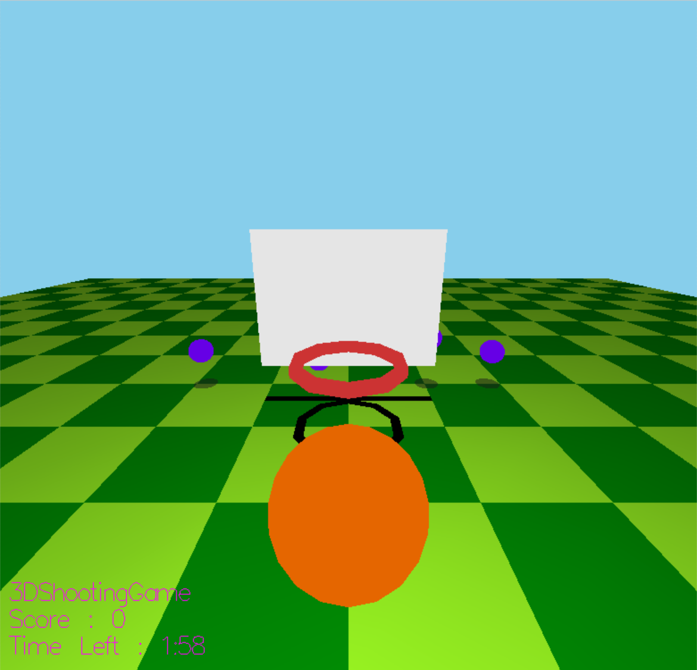

# 3DShootingGame

A small 3D basketball shooting game developed as a final project at Keimyung University.

## Overview

This project is a simple 3D basketball game where the player shoots balls into a moving basket. The game uses C++17, OpenGL (or FLTK/GLUT depending on your setup), and a custom physics engine (Cyclone) for realistic ball and collision behavior.

## Features

- 3D graphics and physics-based ball movement
- Moving basket for increased challenge
- Score and timer display
- Simple and intuitive controls

## Screenshots

*Gameplay view with the basket and balls*

## Animation

Below is a short animation showing the gameplay in action:

## Controls

- Use the mouse to aim and shoot the ball.
